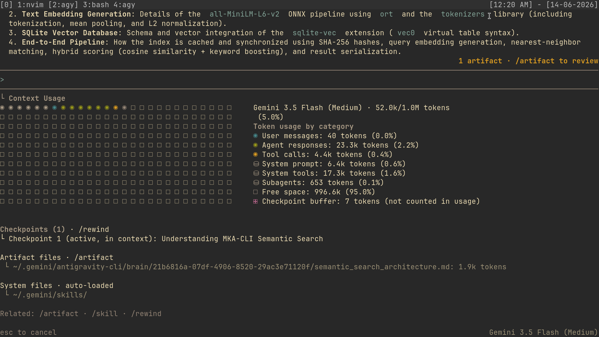
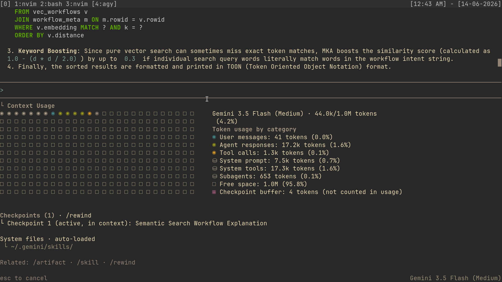

# 📊 Performance Benchmark & Token Verification

This directory profiles the token footprint and context usage of the **Antigravity CLI (`agy`)** connected over the Model Context Protocol (MCP) using `Gemini 3.5 Flash`. We compare a standard exploratory codebase scrape (MKA disabled) against a targeted, MKA-driven workflow retrieval (MKA enabled) when analyzing the semantic search architecture.

---

## 📈 Executive Summary

By using **Modular Knowledge Architecture (MKA)** as a map-first navigation protocol, the LLM avoids unnecessary file tree traversal and redundant parsing. This results in direct savings across all token categories, most notably a **70.4% reduction in tool call overhead**.

| Metric | Without MKA (Baseline) | With MKA (Optimized) | Absolute Savings | % Reduction |
| :--- | :---: | :---: | :---: | :---: |
| **Total Active Session Context** | 52.0k tokens | 44.0k tokens | 8.0k tokens | **15.4%** |
| **Agent Responses (Generation)** | 23.3k tokens | 17.2k tokens | 6.1k tokens | **26.2%** |
| **Tool Calls (Exploration)** | 4.4k tokens | 1.3k tokens | 3.1k tokens | **70.4%** |
| **Model Active Footprint (Responses + Tools)** | 27.7k tokens | 18.5k tokens | 9.2k tokens | **33.2%** |

> [!TIP]
> The **Model Active Footprint** represents the direct cost of LLM generation and tool interactions. A **33.2% reduction** here directly translates to faster response times, lower API costs, and a significantly lower risk of context-drift or hallucinations.

---

## 🔬 Visual Evidence (Before vs. After)

Below is the TUI `/context` panel visualization mapping the structural context variations:

### 1. Baseline Run (Standard Directory Scrape)


### 2. Optimized Run (MKA Enabled)


---

## 🔍 Deep-Dive Token Analysis

### 1. Tool Call Optimization (70.4% Savings)
* **Without MKA (4.4k tokens):** The model had to issue exploratory search tools (e.g. `grep_search`, `list_dir`) and read entire source files to build a mental map of how data transitions from CLI args to SQLite.
* **With MKA (1.3k tokens):** MKA provides the exact list of workflow nodes and surgical snippets in a single step, eliminating exploratory tool calls.

### 2. Active Session Context Reduction (15.4% Savings)
* **Without MKA (52.0k tokens):** The agent was forced to load raw file contents, resulting in a large active token footprint. Additionally, the agent generated a verbose `semantic_search_architecture.md` artifact (1.9k tokens) inside the session to keep track of its findings.
* **With MKA (44.0k tokens):** Since MKA isolates code structures using Tree-sitter parsers and presents them in TOON (Token Oriented Object Notation), the active context was kept lean and free of unnecessary code noise.

### 3. Agent Response Generation (26.2% Savings)
* **Without MKA (23.3k tokens):** Due to the lack of structure, the agent spent more tokens thinking step-by-step and detailing the locations of components.
* **With MKA (17.2k tokens):** Having a predefined technical map enabled the agent to formulate concise, hyper-focused answers without verbose preamble or location guesswork.

---

## 🛠️ Reproduction Methodology

To reproduce these metrics in your local workspace:

### Step 1: Establish the Baseline (MKA Disabled)
1. Temporarily bypass your loaded configurations or plugins:
   ```bash
   ANTIGRAVITY_CONFIG_DIR=/tmp/agy_clean agy
   ```
2. Run a discovery task:
   > *"Analyze the internal workflow of our semantic search architecture and map out how data transitions."*
3. Open the TUI slash command `/context` to view token usage.

### Step 2: Run the Optimized Flow (MKA Enabled)
1. Connect `agy` to your active MKA profile:
   ```bash
   agy plugin install templates/mka-plugin
   ```
2. Run the exact same prompt.
3. Open `/context` to check the optimized metrics.
